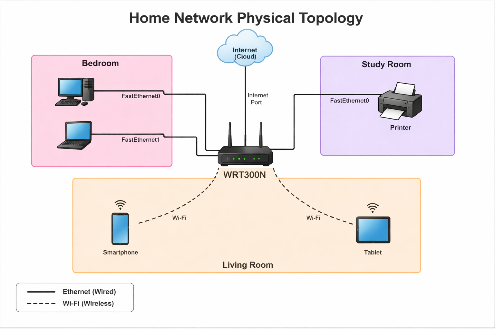
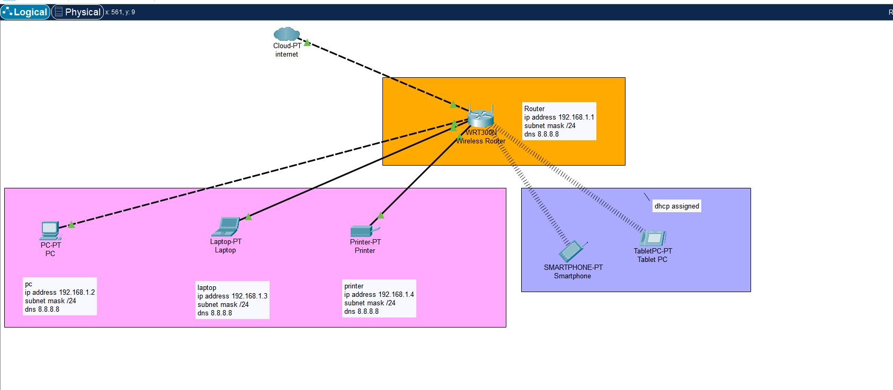

# Home Network Documentation

**Student Name:** Avneet Kaur Sembhi  
**Course:** Technical Writing and Documentation  

---

#  1. Physical Topology

## 🧭 Overview
The physical topology represents how network devices are physically arranged in the home environment, including their locations, cabling, and connection types (Ethernet and Wi-Fi).

---

## 🖼️ Physical Topology Diagram

---

## 📍 Device Locations

| Device           | Location      | Connection Type | Interface Used |
|------------------|--------------|----------------|----------------|
| Wireless Router  | Living Room  | Wired + Wi-Fi  | Internet Port |
| PC               | Bedroom      | Ethernet       | FastEthernet0 |
| Laptop           | Bedroom      | Ethernet       | FastEthernet0 |
| Printer          | Study Room   | Ethernet       | FastEthernet0 |
| Smartphone       | Anywhere     | Wi-Fi          | Wireless |
| Tablet           | Anywhere     | Wi-Fi          | Wireless |

---

## 🔌 Physical Connections

### Ethernet (Wired)
- PC → Router (FastEthernet0)
- Laptop → Router (FastEthernet0)
- Printer → Router (FastEthernet0)

### Wi-Fi (Wireless)
- Smartphone → Router  
- Tablet → Router  

---

## 🧱 Physical Layout Description
- The **Wireless Router** is centrally located in the **Living Room** to provide optimal wireless coverage.
- The **PC and Laptop** are located in the **Bedroom** and connected via Ethernet cables.
- The **Printer** is placed in the **Study Room** and connected via Ethernet.
- The **Smartphone and Tablet** connect wirelessly from any location within the home.

---

# 🌐 2. Logical Topology

## 🧩 Overview
The logical topology represents how data flows within the network and how devices communicate with each other.

---

## 🖼️ Logical Topology Diagram

---

## 🔗 Network Design
- **Topology Type:** Star Topology  
- All devices connect to a **central wireless router**

---

## 🔄 Data Flow

The flow of data in the network follows a centralized pattern where all communication passes through the wireless router.

---

## 📡 Network Characteristics
- Single LAN network (`192.168.1.0/24`)
- No VLAN segmentation
- Router manages all traffic and communication

---

# 📊 3. Addressing Documentation

| Device        | IP Address    | Subnet Mask     | Default Gateway | DNS       |
|---------------|--------------|----------------|----------------|----------|
| Router        | 192.168.1.1  | 255.255.255.0  | N/A            | 8.8.8.8  |
| PC            | 192.168.1.2  | 255.255.255.0  | 192.168.1.1    | 8.8.8.8  |
| Laptop        | 192.168.1.3  | 255.255.255.0  | 192.168.1.1    | 8.8.8.8  |
| Printer       | 192.168.1.4  | 255.255.255.0  | 192.168.1.1    | 8.8.8.8  |
| Smartphone    | DHCP         | DHCP           | DHCP           | DHCP     |
| Tablet        | DHCP         | DHCP           | DHCP           | DHCP     |

---

# 🖧 4. Network Devices and Services

## 📡 Wireless Router
The wireless router is the central device in the network and performs the following functions:
- Acts as a **Default Gateway**
- Provides **DHCP services**
- Enables **wireless connectivity**
- Routes traffic between internal network and the Internet

---

## 🌍 Network Services

| Service | Description |
|--------|------------|
| DHCP   | Automatically assigns IP addresses to wireless devices |
| DNS    | Resolves domain names using Google DNS (8.8.8.8) |
| Internet | Provides external connectivity via ISP |

---

# ⚙️ 5. Device Configurations

## 🖥️ Wired Devices (PC, Laptop, Printer)
- Configured with **static IP addresses**
- Manually assigned:
  - IP address
  - Subnet mask
  - Default gateway
  - DNS server
- Connected using Ethernet cables

---

## 📱 Wireless Devices (Smartphone, Tablet)
- Configured using **DHCP**
- Automatically receive:
  - IP address
  - Gateway
  - DNS
- Connected via Wi-Fi

---

# 🔐 6. Credential Security

To securely manage login credentials:

- A **password manager** (e.g., Bitwarden) is used to store credentials securely
- Default router username and password have been changed
- Wi-Fi network is secured using **WPA2 encryption**
- No sensitive information is stored in plain text

---

# ✅ 7. Testing and Verification

The following tests were performed to verify network functionality:

- Successful **ping tests** between devices
- Verified **internet connectivity**
- Confirmed all devices can reach the router
- Printer accessible from PC and Laptop

---

---

